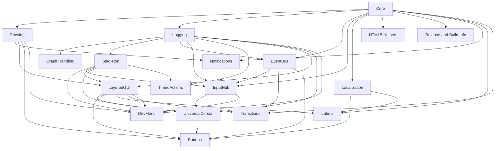

# Game Maker Common Utils

A collection of reusable GameMaker utilities.

The primary workflow is an editable Git submodule: add this repository to a
project, use the resources from inside the submodule, improve the utilities
from any consuming project, push those changes here, and pull them into other
projects later.

This repository includes a lightweight `gamemaker-common-utils.yyp` project so
GameMaker can resolve the resource files as belonging to a project when using
the IDE's import tools. Consuming games still register or import the desired
resources into their own `.yyp`.

For editable shared code, do not use GameMaker's import as the final link. The
IDE copies imported resources into the consumer project. The working live-edit
pattern is:

1. Add this repo as `vendor/gamemaker-common-utils`.
2. Keep the consumer `.yyp` pointing to normal local resource paths such as
   `scripts/gmcu_event_bus/gmcu_event_bus.yy`.
3. Replace each local resource folder with a symlink to the matching folder in
   `vendor/gamemaker-common-utils`.

With that setup, GameMaker still opens local-looking paths, while edits land in
the submodule.

## Current Modules

Import modules in this order:

1. [`Core`](docs/modules/core.md): Shared macros and foundational helpers.
2. [`Drawing`](docs/modules/drawing.md): Temporary draw-state management.
3. [`Logging`](docs/modules/logging.md): Severity-aware logging with optional output and telemetry handlers.
4. [`Crash Handling`](docs/modules/crash-handling.md): Shared unhandled-exception boilerplate with one optional terminal callback.
5. [`Singleton`](docs/modules/singleton.md): Simple persistent singleton helper for shared managers.
6. [`EventBus`](docs/modules/event-bus.md): Publish-subscribe event dispatch.
7. [`InGameNotifications`](docs/modules/in-game-notifications.md): Optional visual development notifications.
8. [`InputHub`](docs/modules/input-hub.md): Centralized keyboard and gamepad input.
9. [`Localization`](docs/modules/localization.md): CSV-backed translation lookup.
10. [`LayeredGUI`](docs/modules/layered-gui.md): Priority-ordered Draw GUI callbacks.
11. [`UniversalCursor`](docs/modules/universal-cursor.md): Mouse, keyboard, and gamepad GUI cursor.
12. [`Buttons`](docs/modules/buttons.md): Reusable localized buttons.
13. [`Labels`](docs/modules/labels.md): Reusable localized game and GUI labels.
14. [`TimedActions`](docs/modules/timed-actions.md): Persistent delayed callbacks.
15. [`Transitions`](docs/modules/transitions.md): Reusable room transitions.
16. [`HTML5 Helpers`](docs/modules/html5-helpers.md): Browser detection and HTML5 runtime helpers.
17. [`Release and Build Info`](docs/modules/release-and-build-info.md): Export, local serving, versioning, publishing, and runtime build information.
18. [`Dev Menu`](docs/modules/dev-menu.md): DevBuild-only diagnostic overlay.

## Dependency Overview



Each module page documents its resources, dependencies, API, usage, and
consumer ownership boundaries. The implementation and migration checklist lives in
[`docs/implementation-plan.md`](docs/implementation-plan.md).

Module pages should stay concise. Do not add repeated boilerplate sections when
the root README already owns the shared workflow, editable-submodule pattern,
or generic contribution rules.

## Add As A Submodule

From the consuming GameMaker project:

```sh
git submodule add https://github.com/edcasillas/gamemaker-common-utils.git vendor/gamemaker-common-utils
git submodule update --init --recursive
```

Then register the desired `.yy` resources from
`vendor/gamemaker-common-utils` in the consuming project's `.yyp`, but keep the
consumer `.yyp` resource paths local. For example, use
`scripts/gmcu_event_bus/gmcu_event_bus.yy`, then symlink `scripts/gmcu_event_bus` to
`vendor/gamemaker-common-utils/scripts/gmcu_event_bus`.

If importing through the GameMaker IDE, import from inside the full checked-out
repository, not from loose copied `.yy` files. GameMaker expects a parent `.yyp`
project for the resource file. Treat this as a registration/bootstrap step:
GameMaker imports are copied, so replace the copied folder with a symlink if the
resource should remain editable through the submodule.

Open the project in GameMaker after registering resources. GameMaker may
reserialize `.yy` or `.yyp` files, and runtime behavior cannot be fully
validated from the command line.

## Update A Consuming Project

```sh
cd vendor/gamemaker-common-utils
git pull origin main
cd ../..
git status
git add vendor/gamemaker-common-utils
git commit -m "Update gamemaker-common-utils"
```

## Modify The Library From A Consuming Project

```sh
cd vendor/gamemaker-common-utils
# edit shared utility files
git status
git add .
git commit -m "Describe common utils change"
git push origin main
cd ../..
git add vendor/gamemaker-common-utils
git commit -m "Update gamemaker-common-utils pointer"
```

## Consumer Import Checklist

- Confirm the consuming repo state with `git status`.
- Add or update the submodule.
- Register modules in dependency order: `Core`, `Drawing`, `Logging`,
  optional `Crash Handling`, `Singleton`, `EventBus`, optional
  `InGameNotifications`, `InputHub`, `Localization`, `LayeredGUI`,
  `UniversalCursor`, `Buttons`, `Labels`, `TimedActions`, then `Transitions`,
  `HTML5 Helpers`, and `Release and Build Info` if needed.
- Keep `.yyp` paths local and symlink local folders to this submodule.
- Check for name conflicts before replacing local resources.
- Run `git diff --check`.
- Open the project in GameMaker and run a smoke test.
- Report whether only source/docs changed or whether GameMaker reserialized
  `.yy`/`.yyp` files.

Generic editable-submodule guidance belongs here in the root README. Repeat it
inside a module page only when that module has a real exception or a module-
specific maintenance rule.

## Current Limits

- No `.yymps` package is generated yet.
- This repo includes a lightweight project container, not a standalone playable
  sample project.
- GameMaker IDE validation is still required after import.
- Logging is portable and does not depend directly on provider services.
  Consumers can register a telemetry handler to preserve
  project-specific log forwarding without coupling the shared module to an
  analytics SDK. Consumers can also register an output handler; HTML5 consumers
  can use `gmcu_html5_use_browser_console_for_logging()` to preserve browser
  severity without rewriting the adapter in each project.
- Crash handling is shared boilerplate, but terminal actions remain
  consumer-owned. Consumers can install the shared unhandled-exception flow and
  run one project-specific terminal callback without coupling Common Utils to a
  specific analytics provider.
- Provider integrations such as GameAnalytics and GlobalStats.io remain
  consumer-owned. GameAnalytics can connect to Logging through
  `gmcu_log_set_telemetry_handler`; GlobalStats.io clients may use Logging and
  EventBus without becoming Common Utils modules.
- HTML5 build/export behavior still requires GameMaker IDE validation.
- Release export and deployment are intentionally separate. The tooling never
  publishes automatically after an export; the exact artifact must be tested
  and deployment must be invoked explicitly.
