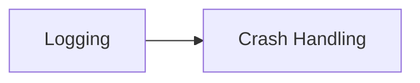

# Crash Handling

`Crash Handling` installs a reusable unhandled-exception flow for release
builds. It writes one fatal crash line, runs one optional terminal callback,
and shows a generic crash dialog.

## Quickstart

Install the handler from your bootstrap and keep any build-policy gate in the
consumer:

```gml
if (!IS_DEV_BUILD) {
	// Terminal work stays consumer-owned.
	gmcu_install_unhandled_exception_handler(function(_fatal_message) {
		analytics_report_critical(_fatal_message);
		analytics_close_session();
	});
}
```

## Resources

- `scripts/gmcu_install_unhandled_exception_handler`

## Dependencies

| Module | Responsibility |
| --- | --- |
| [`Logging`](logging.md) | Supplies log context tags, output routing, and exception logging for terminal callback failures. |

## Dependency Diagram



## API

| Item | Kind | Description |
| --- | --- | --- |
| `gmcu_install_unhandled_exception_handler(_terminal_action = undefined)` | Function | Installs the shared unhandled-exception flow and optionally runs one terminal callback with the formatted fatal message. |

The terminal callback receives exactly one argument: the formatted fatal
message. It may ignore that argument if it does not need it.

The shared flow builds a generic crash dialog using `game_display_name` and
appends ` v<global.build_number>` only when that global exists.

Fatal crash logging is crash-path-only behavior owned by this module. Logging
does not expose a public fatal severity or Dev Menu filter.
