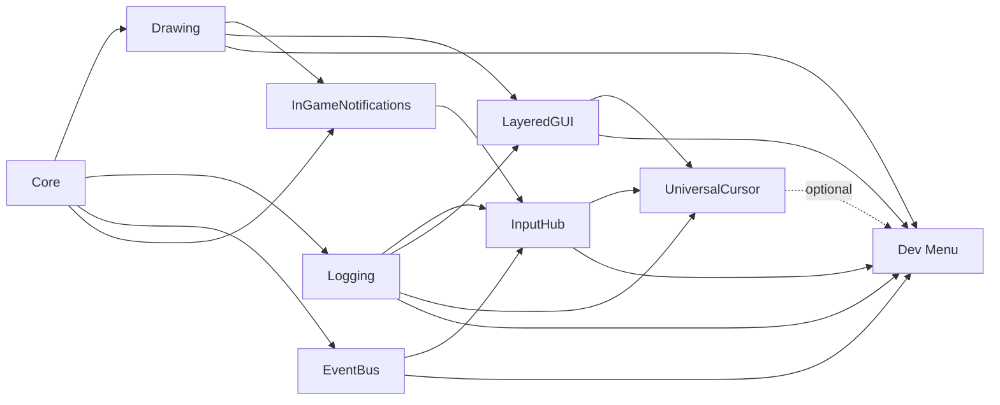

# Dev Menu

`Dev Menu` provides a programmatically configured, persistent development
overlay. It is available only when `GMCU_IS_DEV_BUILD` is true and does not require
an object to be placed in a room.

## Usage

Create a root page and pass it to `gmcu_dev_menu_init`. The function creates or
reconfigures the persistent menu singleton.

The consumer owns a plain `config` struct. That struct tells the singleton:

- which pages exist
- how the menu should open
- how the theme should look

The important detail is that the trigger callback only answers a yes/no
question. The menu object itself calls that callback every Step and decides
whether to open, close, or keep navigating the current page.

## Resources

- `scripts/gmcu_dev_menu`
- `objects/gmcu_o_dev_menu`

## Dependencies

| Module | Responsibility |
| --- | --- |
| [`Core`](core.md) | Supplies DevBuild policy and shared constants. |
| [`Drawing`](drawing.md) | Protects overlay draw state. |
| [`Logging`](logging.md) | Reports callback failures and supplies log history. |
| [`InputHub`](input-hub.md) | Supplies keyboard/gamepad navigation. |
| [`EventBus`](event-bus.md) | Used to dispatch events on menu opened / closed. |
| [`LayeredGUI`](layered-gui.md) | Owns final overlay draw order when present, so the Dev Menu renders above gameplay GUI. Supplies subscriber diagnostics when its manager exists in the current room.|
| [`UniversalCursor`](universal-cursor.md) (optional) | Supplies interactable and hover diagnostics while its singleton exists. |

## Dependency Diagram



## Quickstart

```gml
var _config = {
    pages: [
        // gmcu_dev_menu_static_page(id, title, items)
        // "main" is the root page id. Submenus can open this page by id.
        // "Dev Menu" is the visible page title shown in the header.
        gmcu_dev_menu_static_page("main", "Dev Menu", [
            // gmcu_dev_menu_action(label, callback)
            // This creates one selectable row in the page.
            gmcu_dev_menu_action("Run action", function() {
                show_debug_message("Action");
            })
        ])
    ]
};

// Creates the persistent singleton the first time, or reconfigures it later.
gmcu_dev_menu_init(_config);
```

Dynamic root-page example:

```gml
function build_root_items() {
    // Dynamic pages are useful when the visible rows depend on current state.
    // This row list changes depending on whether a run is active.
    if(global.run_in_progress) {
        return [
            gmcu_dev_menu_action("Resume run", function() {
                show_debug_message("Resume");
            }),
            gmcu_dev_menu_action("Abort run", function() {
                show_debug_message("Abort");
            })
        ];
    }

    return [
        gmcu_dev_menu_action("Start run", function() {
            show_debug_message("Start");
        })
    ];
}

gmcu_dev_menu_init({
    pages: [
        // Root page:
        // - id: "main"
        // - title: "Dev Menu"
        // - build_items_func: build_root_items
        // The menu calls build_root_items() to rebuild the visible rows.
        gmcu_dev_menu_dynamic_page("main", "Dev Menu", build_root_items),

        // Secondary page opened by the submenu above.
        gmcu_dev_menu_static_page("gameplay", "Gameplay", [
            // Toggle rows ask for the current value and a setter callback.
            gmcu_dev_menu_toggle("God mode", function() { return global.god_mode; }, function(_value) {
                global.god_mode = _value;
            })
        ])
    ]
});
```

In this example the root page is dynamic because it does not always show the
same rows:

- when `global.run_in_progress` is false, it shows `Start run`
- when `global.run_in_progress` is true, it shows `Resume run` and `Abort run`

Use a dynamic page when the menu content itself should change with current game
state. Use a static page when the same rows should always be present.

HTML5 note: Dev Menu stores callbacks for later use. On HTML5, avoid callbacks
that depend on captured local variables. Prefer named scripts or functions that
read from stable struct fields or globals, then validate dynamic pages and
actions in a real HTML5 runner.

`gmcu_dev_menu_init` creates the persistent object, or reconfigures and returns
the existing instance. Outside `DevBuild` it returns `noone`.

The default trigger is F1. Supply `trigger_pressed` in the config to replace
it.

Opening and closing the menu dispatch these Event Bus events:

- `GMCU_EVENT_DEV_MENU_OPENED`
- `GMCU_EVENT_DEV_MENU_CLOSED`

Consumers that care about menu lifecycle should subscribe to those events.

## API

### Config Struct

`gmcu_dev_menu_init(_config)` accepts a consumer-owned struct with these fields:

- `pages`
  Array of page structs. Optional but strongly recommended. If omitted or empty,
  the menu creates a default root page.
- `trigger_pressed`
  Optional callback returning true on the Step where the menu should open or
  close. Default: `gmcu_dev_menu_default_trigger()`, which checks `F1`.
- `theme`
  Optional struct overriding overlay/panel/text/log colors and font.

### Page Builders

- `gmcu_dev_menu_static_page(_id, _title, _items = [])`
  Creates a page with a fixed item array.
- `gmcu_dev_menu_dynamic_page(_id, _title, _build_items_func)`
  Creates a page whose rows are rebuilt by a function.
- `gmcu_dev_menu_action(_label, _action, _enabled = undefined)`
  Creates a row that runs a callback.
- `gmcu_dev_menu_submenu(_label, _page_id)`
  Creates a row that opens another page.
- `gmcu_dev_menu_toggle(_label, _get_value, _set_value)`
  Creates a boolean row that toggles on activation.
- `gmcu_dev_menu_value(_label, _get_value, _change_value)`
  Creates a row that changes with left/right input.

### Runtime Helpers

- `gmcu_dev_menu_default_trigger()`
  Returns true when the default open/close trigger fires.
- `gmcu_dev_menu_init(_config)`
  Creates or reconfigures the singleton menu object.
- `gmcu_dev_menu_is_open()`
  Returns whether the singleton is currently open.
- `gmcu_ui_overlay_blocks_pointer_input()`
  Returns whether overlay UI currently owns gameplay pointer input.

### GUI Ordering

When [`LayeredGUI`](layered-gui.md) is available, the Dev Menu subscribes at
`GMCU_GUI_PRIORITY_DEV_MENU`, which places it above the common gameplay GUI
layers defined in [`Core`](core.md). If LayeredGUI is not present, the menu
falls back to its own `Draw GUI` event.

### Lifecycle Events

- `GMCU_EVENT_DEV_MENU_OPENED`
  Dispatched when the menu finishes opening.
- `GMCU_EVENT_DEV_MENU_CLOSED`
  Dispatched when the menu closes.

### Built-In Page Adapters

- `gmcu_dev_menu_add_rooms(_config, _settings = {})`
  Adds a generated Rooms page and root submenu.
- `gmcu_dev_menu_add_languages(_config, _settings)`
  Adds a generated Language page and root submenu.
- `gmcu_dev_menu_add_logs(_config)`
  Adds the built-in Logs page and root submenu.

The room module supports filter, label, sorting, and transition callbacks.
Language integration is callback-based. The log viewer reads the bounded
structured buffer maintained by the Logging module. Log rows use severity
colors by default: debug is white, info is muted gray, warnings are yellow,
and errors or exceptions are red. Override these theme fields when needed:

- `log_debug_color`
- `log_info_color`
- `log_warn_color`
- `log_error_color`

The built-in `Logs` page starts with one compact `Severity` row. It exposes
inline chips for `DEBUG`, `INFO`, `WARN`, `ERROR`, and `EXCEPTION`, then shows
`Clear logs`, then the filtered entries. With keyboard or gamepad, select the
row, use left/right to move between chips, and press Enter / confirm to toggle
the focused chip. Mouse clicks toggle chips directly.

Log rows are copyable. Select one and press Enter, the gamepad confirmation
button, or click it to copy the complete message to the clipboard.

When [`LayeredGUI`](layered-gui.md) is also imported, the root page
automatically includes `Layered GUI` while its manager exists in the current
room. The page shows priority, object name, optional diagnostic name, and
instance id in actual draw order. Its rows use the same clipboard interaction
as logs. The snapshot refreshes each time the menu opens. The integration
resolves the optional manager by asset name, so Dev Menu does not require the
diagnostic page dependency even though it uses LayeredGUI for draw ordering.

When [`UniversalCursor`](universal-cursor.md) is imported, the root page also
adds `Universal Cursor` while its singleton exists. The page lists object name,
optional diagnostic name, instance id, and the subscriber that was hovered
when the menu opened. Its rows are copyable. The snapshot is taken from live
instances because the Dev Menu is non-modal. The optional cursor is resolved by
asset name, so Dev Menu does not require UniversalCursor.

Keyboard, gamepad, mouse hover, click, and wheel input are supported. Mobile
gestures can later be implemented through a custom `trigger_pressed` callback.

Static vs dynamic pages:

- Static page: use `gmcu_dev_menu_static_page(...)` when the row list is fixed.
- Dynamic page: use `gmcu_dev_menu_dynamic_page(...)` when the row list, labels,
  or enabled state must be rebuilt from current game state.

`_build_items_func` must be a function that returns an array of Dev Menu items.

## Input Flow

The open/close trigger is checked by `gmcu_o_dev_menu` in its `Step` event, not
by `gmcu_dev_menu_default_trigger()` itself.

The flow is:

1. `gmcu_dev_menu_init(_config)` stores the consumer config on the singleton.
2. If `_config.trigger_pressed` is missing, `configure()` assigns
   `gmcu_dev_menu_default_trigger`.
3. Each Step, `gmcu_o_dev_menu/Step_1.gml` calls `config.trigger_pressed()`.
4. When that callback returns true:
   - if the menu is closed, it calls `open_menu()`
   - if the menu is open, it calls `close_menu()`
5. `open_menu()` dispatches `GMCU_EVENT_DEV_MENU_OPENED`.
6. `close_menu()` dispatches `GMCU_EVENT_DEV_MENU_CLOSED`.

That same `Step` event also handles menu navigation while `is_open` is true:

- `Esc` or gamepad cancel -> `go_back()`
- `Up` / `Down` -> selection movement
- `Left` / `Right` -> value change activation
- `Enter` / `Space` / gamepad confirm -> item activation
- mouse move / click / wheel -> hover, click, and scroll

## Room Navigation

The room adapter changes rooms but cannot initialize game-specific persistent
state. Consumers whose rooms depend on a controller, save state, or progression
object must provide a `goto_room` callback that prepares that state before
calling `room_goto`.

Rooms intended for direct IDE testing should also bootstrap their required
state independently rather than assuming they were entered through normal
progression.
