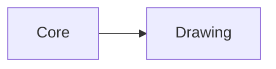

# Drawing

`Drawing` captures and restores GameMaker draw state so reusable UI code does
not leak font, color, alignment, or alpha changes into later drawing.

## Quickstart

Create a snapshot before temporary draw changes and call `apply()` afterward:

```gml
// Capture the current draw state before changing it.
var _draw_state = new gmcu_DrawingParameters();
draw_set_color(c_red);
draw_text(32, 32, "Warning");
// Restore the previous font, color, alignment, and alpha.
_draw_state.apply();
```

## Resources

- `scripts/gmcu_drawing_parameters`: Declares the draw-state snapshot
  constructor and its restore method.

## Dependencies

| Module | Responsibility |
| --- | --- |
| [`Core`](core.md) | Base dependency required by the draw-state helper. |

## Dependency Diagram



## API

| Item | Kind | Description |
| --- | --- | --- |
| `new gmcu_DrawingParameters()` | Constructor | Captures the current font, color, horizontal alignment, vertical alignment, and alpha. |
| `gmcu_DrawingParameters.apply()` | Method | Restores the captured draw state. |
