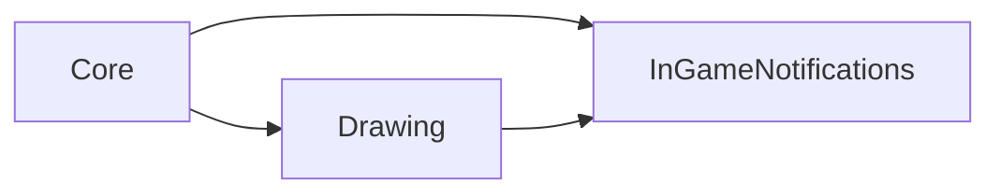

# InGameNotifications

`InGameNotifications` displays queued, animated messages and connects optional
visual error reporting to [`Logging`](logging.md).

## Quickstart

Pass text for defaults or customize a settings instance:

```gml
// Use the default look with a custom message.
gmcu_show_notification("Gamepad connected");

// Or customize the presentation before showing it.
var _settings = new gmcu_InGameNotificationSettings("Gamepad connected");
_settings.back_color = c_gray;
gmcu_show_notification(_settings);
```

Importing the module registers its handler through
`gmcu_set_notification_handler`.

## Resources

- `scripts/gmcu_in_game_notification_settings`: Notification presentation
  constructor.
- `scripts/gmcu_show_notification`: Creates notifications and registers the
  Logging adapter.
- `objects/gmcu_o_notification_from_top`: Persistent animated notification
  instance.

## Dependencies

| Module | Responsibility |
| --- | --- |
| [`Core`](core.md) | Supplies timing, depth, build policy, and handler state. |
| [`Drawing`](drawing.md) | Restores draw state after rendering. |

## Dependency Diagram



## API

| Item | Kind | Description |
| --- | --- | --- |
| `new gmcu_InGameNotificationSettings(_text)` | Constructor | Creates editable notification presentation settings. |
| `gmcu_show_notification(_text_or_settings)` | Function | Queues a notification from text or a settings instance. |
| `gmcu_o_notification_from_top` | Object | Runtime notification object. |
| `global.gmcu_in_game_notifications_tail` | Global | Tail of the active notification queue. |

In `DevBuild`, `gmcu_log_error` and `gmcu_log_exception` may use this module
without making Logging depend directly on it.

## Contributing

Keep the three resource paths local under their `gmcu_` names and symlink their
folders to Common Utils.
