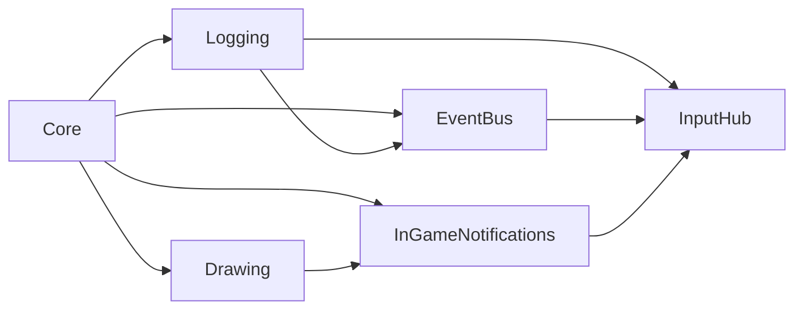

# InputHub

`InputHub` centralizes basic keyboard and gamepad direction state, gamepad
connect/disconnect tracking, and gamepad button press/release events.

## Quickstart

Place one `gmcu_o_input_hub` instance in the first room that should initialize
input. The object is persistent and deletes duplicate instances.

Read direction state through the instance methods:

```gml
// Poll the current combined direction.
var _direction = gmcu_o_input_hub.gmcu_get_direction();
var _four_way_direction = gmcu_o_input_hub.gmcu_get_four_way_direction();
```

Subscribe through [`EventBus`](event-bus.md) when code should react to any
monitored gamepad button press or release. The dispatched event argument is the
GameMaker `gp_*` button constant:

```gml
// Receiver Create
gmcu_eventbus_subscribe(GMCU_EVENT_GAMEPAD_BUTTON_PRESSED);

on_event = function(_event_name, _event_args) {
    if (_event_name == GMCU_EVENT_GAMEPAD_BUTTON_PRESSED
    && _event_args == gp_face1) {
        // Handle the primary face button.
    }
};
```

Use `gmcu_gamepad_button_pressed()` and `gmcu_gamepad_button_released()` for
direct polling when an event subscription is unnecessary.

## Resources

- `scripts/gmcu_input_hub_events`: Declares the
  [`EventBus`](event-bus.md) event names and the `GMCU_DIRECTION_ANGLE`
  direction enum.
- `scripts/gmcu_gamepad_buttons_mapping`: Initializes
  `global.gmcu_gamepad_buttons_mapping`, which maps GameMaker `gp_*` constants
  to readable names used by debug logs.
- `objects/gmcu_o_input_hub`: Persistent runtime controller that tracks
  connected gamepads, combines keyboard and gamepad direction input, and
  dispatches monitored gamepad button events.

## Dependencies

| Module | Responsibility |
| --- | --- |
| [`EventBus`](event-bus.md) | Dispatches gamepad button press and release events. |
| [`Logging`](logging.md) | Writes gamepad connection and button debug output. |
| [`InGameNotifications`](in-game-notifications.md) | Shows DevBuild gamepad connect and disconnect notifications. |
| [`Core`](core.md) | Indirect base dependency used by the modules above. |

## Dependency Diagram



## API

| Item | Kind | Description |
| --- | --- | --- |
| `GMCU_EVENT_GAMEPAD_BUTTON_PRESSED` | Event | Dispatched once when a monitored gamepad button becomes pressed. |
| `GMCU_EVENT_GAMEPAD_BUTTON_RELEASED` | Event | Dispatched once when a monitored gamepad button becomes released. |
| `GMCU_DIRECTION_ANGLE` | Enum | Named GameMaker direction angles for the eight cardinal and diagonal directions. |
| `gmcu_o_input_hub` | Object | Persistent singleton-style controller for direction state and monitored gamepad input. |
| `gmcu_o_input_hub.gmcu_get_direction()` | Method | Returns the current combined direction angle, or `undefined` when idle. |
| `gmcu_o_input_hub.gmcu_get_four_way_direction()` | Method | Reduces current input to `UP`, `DOWN`, `LEFT`, or `RIGHT`, or `undefined` when idle. |
| `gmcu_o_input_hub.gmcu_has_connected_gamepad()` | Method | Returns whether Input Hub has tracked at least one connected gamepad. |
| `gmcu_o_input_hub.gmcu_gamepad_button_pressed(_button)` | Method | Returns whether the requested `gp_*` button was pressed on gamepad slot `0` this Step. |
| `gmcu_o_input_hub.gmcu_gamepad_button_released(_button)` | Method | Returns whether the requested `gp_*` button was released on gamepad slot `0` this Step. |
| `global.gmcu_gamepad_buttons_mapping` | Global | Readable names for `gp_*` constants used by debug output. |

## Contributing

For editable submodule use, keep the consumer `.yyp` paths local:

- `objects/gmcu_o_input_hub/gmcu_o_input_hub.yy`
- `scripts/gmcu_input_hub_events/gmcu_input_hub_events.yy`
- `scripts/gmcu_gamepad_buttons_mapping/gmcu_gamepad_buttons_mapping.yy`

Then symlink those local folders to the matching folders under
`vendor/gamemaker-common-utils`.
