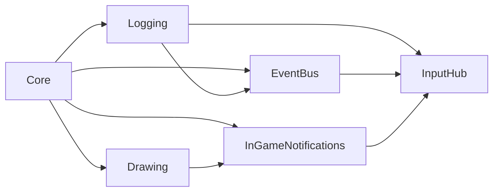

# InputHub

`InputHub` owns monitored keyboard and gamepad hardware input for gameplay and
the Dev Menu. It centralizes direction state, gamepad connect/disconnect
tracking, and routed press/release interactions with `press owns release`
semantics.

## Quickstart

Place one `gmcu_o_input_hub` instance in the first room that should initialize
input. The object is persistent and deletes duplicate instances.

Read direction state through the instance methods:

```gml
// Poll the current combined direction.
var _direction = gmcu_o_input_hub.gmcu_get_direction();
var _four_way_direction = gmcu_o_input_hub.gmcu_get_four_way_direction();
```

Subscribe through [`EventBus`](event-bus.md) when gameplay code should react to
monitored keyboard or gamepad press/release events. The dispatched event
argument is the GameMaker `vk_*` or `gp_*` constant:

```gml
// Receiver Create
gmcu_eventbus_subscribe(GMCU_EVENT_KEYBOARD_KEY_RELEASED);
gmcu_eventbus_subscribe(GMCU_EVENT_GAMEPAD_BUTTON_PRESSED);

on_event = function(_event_name, _event_args) {
    if (_event_name == GMCU_EVENT_KEYBOARD_KEY_RELEASED
    && _event_args == vk_escape) {
        toggle_pause();
    }
    if (_event_name == GMCU_EVENT_GAMEPAD_BUTTON_PRESSED
    && _event_args == gp_face1) {
        // Handle the primary face button.
    }
};
```

Use `gmcu_keyboard_key_pressed()`, `gmcu_keyboard_key_released()`,
`gmcu_gamepad_button_pressed()`, and `gmcu_gamepad_button_released()` for
direct polling when an event subscription is unnecessary.

## Resources

- `scripts/gmcu_input_hub_events`: Declares the
  [`EventBus`](event-bus.md) event names, input-owner constants, and the
  `GMCU_DIRECTION_ANGLE` direction enum.
- `scripts/gmcu_gamepad_buttons_mapping`: Initializes
  `global.gmcu_gamepad_buttons_mapping`, which maps GameMaker `gp_*` constants
  to readable names used by debug logs.
- `objects/gmcu_o_input_hub`: Persistent runtime controller that tracks
  connected gamepads, routes monitored keyboard/gamepad interactions to
  gameplay or Dev Menu, combines routed gameplay direction input, and
  dispatches gameplay-facing keyboard/gamepad events.

## Dependencies

| Module | Responsibility |
| --- | --- |
| [`EventBus`](event-bus.md) | Dispatches gameplay-facing keyboard and gamepad press/release events. |
| [`Logging`](logging.md) | Writes gamepad connection and button debug output. |
| [`InGameNotifications`](in-game-notifications.md) | Shows DevBuild gamepad connect and disconnect notifications. |
| [`Core`](core.md) | Indirect base dependency used by the modules above. |
| [`Dev Menu`](dev-menu.md) | Provides the overlay state used to assign ownership of monitored interactions. |

## Dependency Diagram



## API

| Item | Kind | Description |
| --- | --- | --- |
| `GMCU_EVENT_KEYBOARD_KEY_PRESSED` | Event | Dispatched once when gameplay receives a monitored keyboard press. |
| `GMCU_EVENT_KEYBOARD_KEY_RELEASED` | Event | Dispatched once when gameplay receives a monitored keyboard release. |
| `GMCU_EVENT_GAMEPAD_BUTTON_PRESSED` | Event | Dispatched once when a monitored gamepad button becomes pressed. |
| `GMCU_EVENT_GAMEPAD_BUTTON_RELEASED` | Event | Dispatched once when a monitored gamepad button becomes released. |
| `GMCU_INPUT_OWNER_GAMEPLAY` | Constant | Routed-owner name for gameplay input. |
| `GMCU_INPUT_OWNER_DEV_MENU` | Constant | Routed-owner name for Dev Menu input. |
| `GMCU_DIRECTION_ANGLE` | Enum | Named GameMaker direction angles for the eight cardinal and diagonal directions. |
| `gmcu_o_input_hub` | Object | Persistent singleton-style controller for direction state and monitored gamepad input. |
| `gmcu_o_input_hub.gmcu_get_direction()` | Method | Returns the current combined direction angle, or `undefined` when idle. |
| `gmcu_o_input_hub.gmcu_get_four_way_direction()` | Method | Reduces current input to `UP`, `DOWN`, `LEFT`, or `RIGHT`, or `undefined` when idle. |
| `gmcu_o_input_hub.gmcu_has_connected_gamepad()` | Method | Returns whether Input Hub has tracked at least one connected gamepad. |
| `gmcu_o_input_hub.gmcu_keyboard_key_pressed(_key, _owner = GMCU_INPUT_OWNER_GAMEPLAY)` | Method | Returns whether the requested monitored `vk_*` key was pressed for the requested owner this Step. |
| `gmcu_o_input_hub.gmcu_keyboard_key_released(_key, _owner = GMCU_INPUT_OWNER_GAMEPLAY)` | Method | Returns whether the requested monitored `vk_*` key was released for the requested owner this Step. |
| `gmcu_o_input_hub.gmcu_gamepad_button_pressed(_button, _owner = GMCU_INPUT_OWNER_GAMEPLAY)` | Method | Returns whether the requested monitored `gp_*` button was pressed for the requested owner this Step. |
| `gmcu_o_input_hub.gmcu_gamepad_button_released(_button, _owner = GMCU_INPUT_OWNER_GAMEPLAY)` | Method | Returns whether the requested monitored `gp_*` button was released for the requested owner this Step. |
| `global.gmcu_gamepad_buttons_mapping` | Global | Readable names for `gp_*` constants used by debug output. |

Input Hub owns monitored navigation/confirm/cancel keys and routes each
interaction to either `gameplay` or `dev_menu`.

Ownership is assigned on press and preserved until release. If Dev Menu owns a
press, gameplay will not receive the matching release even if the menu closes
before that release happens.

This refactor intentionally monitors only the shared navigation/confirm/cancel
keys needed by gameplay and Dev Menu. General ownership for arbitrary keyboard
keys is a possible future expansion, not an accidental omission.
