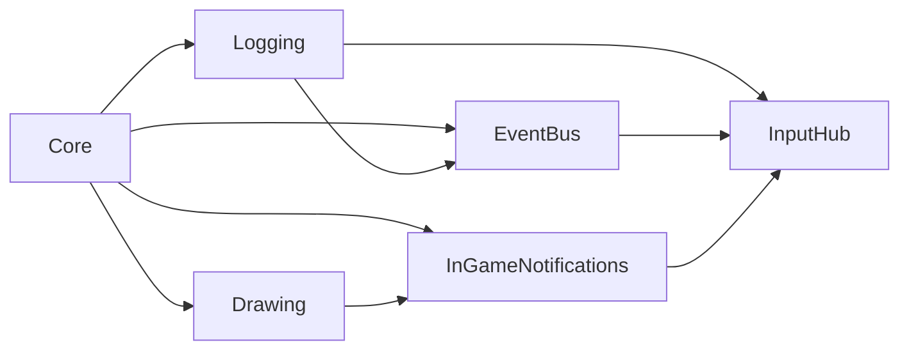

# InputHub

`InputHub` owns registered keyboard and gamepad hardware input for gameplay and
the Dev Menu. It centralizes direction state, gamepad connect/disconnect
tracking, and routed press/release interactions with `press owns release`
semantics.

## Quickstart

Place one `gmcu_o_input_hub` instance in the first room that should initialize
input. The object is persistent and deletes duplicate instances.

Register the discrete keys and buttons the game should monitor. Registration is
explicit, idempotent, and separate from Event Bus subscription:

```gml
// Bootstrap or module init.
gmcu_register_keyboard_key(vk_escape);
gmcu_register_keyboard_key(vk_enter);
gmcu_register_gamepad_button(gp_start);
gmcu_register_gamepad_button(gp_face1);
```

Read direction state through the instance methods after registering the
directional keys and buttons the game uses:

```gml
// Poll the current combined direction.
var _direction = gmcu_o_input_hub.gmcu_get_direction();
var _four_way_direction = gmcu_o_input_hub.gmcu_get_four_way_direction();
```

Subscribe through [`EventBus`](event-bus.md) when gameplay code should react to
registered keyboard or gamepad press/release events. The dispatched event
argument is the GameMaker `vk_*` or `gp_*` constant:

```gml
// Bootstrap or module init.
gmcu_register_keyboard_key(vk_escape);
gmcu_register_gamepad_button(gp_start);

// Receiver Create
gmcu_eventbus_subscribe(GMCU_EVENT_KEYBOARD_KEY_RELEASED);
gmcu_eventbus_subscribe(GMCU_EVENT_GAMEPAD_BUTTON_PRESSED);

on_event = function(_event_name, _event_args) {
    if (_event_name == GMCU_EVENT_KEYBOARD_KEY_RELEASED
    && _event_args == vk_escape) {
        toggle_pause();
    }
    if (_event_name == GMCU_EVENT_GAMEPAD_BUTTON_PRESSED
    && _event_args == gp_face1) {
        // Handle the primary face button.
    }
};
```

Use `gmcu_keyboard_key_pressed()`, `gmcu_keyboard_key_released()`,
`gmcu_gamepad_button_pressed()`, and `gmcu_gamepad_button_released()` for
direct polling when an event subscription is unnecessary.

Polling does not auto-register keys or buttons. If an input was never
registered, polling returns `false` and no events are dispatched for it.

## Resources

- `scripts/gmcu_input_hub_events`: Declares the
  [`EventBus`](event-bus.md) event names, input-owner constants, and the
  `GMCU_DIRECTION_ANGLE` direction enum.
- `scripts/gmcu_input_registration`: Owns the dynamic keyboard/gamepad
  registration registry used by bootstrap code, shared modules, and the runtime
  Input Hub object.
- `scripts/gmcu_gamepad_buttons_mapping`: Initializes
  `global.gmcu_gamepad_buttons_mapping`, which maps GameMaker `gp_*` constants
  to readable names used by debug logs.
- `objects/gmcu_o_input_hub`: Persistent runtime controller that tracks
  connected gamepads, routes registered keyboard/gamepad interactions to
  gameplay or Dev Menu, combines routed gameplay direction input, and
  dispatches gameplay-facing keyboard/gamepad events.

## Dependencies

| Module | Responsibility |
| --- | --- |
| [`EventBus`](event-bus.md) | Dispatches gameplay-facing keyboard and gamepad press/release events. |
| [`Logging`](logging.md) | Writes gamepad connection and button debug output. |
| [`InGameNotifications`](in-game-notifications.md) | Shows DevBuild gamepad connect and disconnect notifications. |
| [`Core`](core.md) | Indirect base dependency used by the modules above. |
| [`Dev Menu`](dev-menu.md) | Provides the overlay state used to assign ownership of registered interactions. |

## Dependency Diagram



## API

| Item | Kind | Description |
| --- | --- | --- |
| `GMCU_EVENT_KEYBOARD_KEY_PRESSED` | Event | Dispatched once when gameplay receives a registered keyboard press. |
| `GMCU_EVENT_KEYBOARD_KEY_RELEASED` | Event | Dispatched once when gameplay receives a registered keyboard release. |
| `GMCU_EVENT_GAMEPAD_BUTTON_PRESSED` | Event | Dispatched once when a registered gamepad button becomes pressed. |
| `GMCU_EVENT_GAMEPAD_BUTTON_RELEASED` | Event | Dispatched once when a registered gamepad button becomes released. |
| `GMCU_INPUT_OWNER_GAMEPLAY` | Constant | Routed-owner name for gameplay input. |
| `GMCU_INPUT_OWNER_DEV_MENU` | Constant | Routed-owner name for Dev Menu input. |
| `GMCU_DIRECTION_ANGLE` | Enum | Named GameMaker direction angles for the eight cardinal and diagonal directions. |
| `gmcu_register_keyboard_key(_key)` | Function | Registers one `vk_*` key for Input Hub monitoring. Repeated registration is safe. |
| `gmcu_unregister_keyboard_key(_key)` | Function | Releases one keyboard registration and stops monitoring when the last owner unregisters the key. |
| `gmcu_register_gamepad_button(_button)` | Function | Registers one `gp_*` button for Input Hub monitoring. Repeated registration is safe. |
| `gmcu_unregister_gamepad_button(_button)` | Function | Releases one gamepad registration and stops monitoring when the last owner unregisters the button. |
| `gmcu_o_input_hub` | Object | Persistent singleton-style controller for direction state and registered discrete keyboard/gamepad input. |
| `gmcu_o_input_hub.gmcu_get_direction()` | Method | Returns the current combined direction angle, or `undefined` when idle. |
| `gmcu_o_input_hub.gmcu_get_four_way_direction()` | Method | Reduces current input to `UP`, `DOWN`, `LEFT`, or `RIGHT`, or `undefined` when idle. |
| `gmcu_o_input_hub.gmcu_has_connected_gamepad()` | Method | Returns whether Input Hub has tracked at least one connected gamepad. |
| `gmcu_o_input_hub.gmcu_keyboard_key_pressed(_key, _owner = GMCU_INPUT_OWNER_GAMEPLAY)` | Method | Returns whether the requested registered `vk_*` key was pressed for the requested owner this Step. |
| `gmcu_o_input_hub.gmcu_keyboard_key_released(_key, _owner = GMCU_INPUT_OWNER_GAMEPLAY)` | Method | Returns whether the requested registered `vk_*` key was released for the requested owner this Step. |
| `gmcu_o_input_hub.gmcu_gamepad_button_pressed(_button, _owner = GMCU_INPUT_OWNER_GAMEPLAY)` | Method | Returns whether the requested registered `gp_*` button was pressed for the requested owner this Step. |
| `gmcu_o_input_hub.gmcu_gamepad_button_released(_button, _owner = GMCU_INPUT_OWNER_GAMEPLAY)` | Method | Returns whether the requested registered `gp_*` button was released for the requested owner this Step. |
| `global.gmcu_gamepad_buttons_mapping` | Global | Readable names for `gp_*` constants used by debug output. |

## Registration Model

Input Hub monitors only the keys and buttons that were registered for the
current game session.

- registration happens once per owner that needs the input to exist at all
- Event Bus subscription still happens per object that wants to react
- repeated registration is safe
- unregistering decrements usage and removes the input only when the count
  reaches zero

Mixed ownership is expected:

- bootstrap can register known gameplay inputs
- shared modules such as Dev Menu or Universal Cursor can register their own
  inputs when they initialize

## Examples

Gameplay Event Consumer:

```gml
// Bootstrap or shared init.
gmcu_register_keyboard_key(vk_escape);
gmcu_register_gamepad_button(gp_start);

// objCtrl Create.
gmcu_eventbus_subscribe(GMCU_EVENT_KEYBOARD_KEY_RELEASED);
gmcu_eventbus_subscribe(GMCU_EVENT_GAMEPAD_BUTTON_PRESSED);

on_event = function(_event_name, _event_args) {
    switch (_event_name) {
        case GMCU_EVENT_KEYBOARD_KEY_RELEASED:
            if (_event_args == vk_escape) {
                set_pause(!is_paused);
            }
            break;
        case GMCU_EVENT_GAMEPAD_BUTTON_PRESSED:
            if (_event_args == gp_start) {
                set_pause(!is_paused);
            }
            break;
    }
};
```

Gameplay Polling Consumer:

```gml
// Bootstrap or shared init.
gmcu_register_keyboard_key(vk_enter);
gmcu_register_keyboard_key(vk_left);
gmcu_register_keyboard_key(vk_right);
gmcu_register_keyboard_key(vk_up);
gmcu_register_keyboard_key(vk_down);
gmcu_register_gamepad_button(gp_start);
gmcu_register_gamepad_button(gp_padl);
gmcu_register_gamepad_button(gp_padr);
gmcu_register_gamepad_button(gp_padu);
gmcu_register_gamepad_button(gp_padd);
gmcu_register_gamepad_button(gp_face1);

// Step.
if (gmcu_o_input_hub.gmcu_keyboard_key_released(vk_enter)
|| gmcu_o_input_hub.gmcu_gamepad_button_pressed(gp_start)) {
    commit();
}
```

Shared Module-Owned Registration:

```gml
// Shared module Create / initialization.
gmcu_register_keyboard_key(vk_escape);
gmcu_register_keyboard_key(vk_enter);
gmcu_register_keyboard_key(vk_left);
gmcu_register_keyboard_key(vk_right);
gmcu_register_keyboard_key(vk_up);
gmcu_register_keyboard_key(vk_down);
gmcu_register_gamepad_button(gp_face1);
gmcu_register_gamepad_button(gp_face2);
gmcu_register_gamepad_button(gp_padl);
gmcu_register_gamepad_button(gp_padr);
gmcu_register_gamepad_button(gp_padu);
gmcu_register_gamepad_button(gp_padd);

function check_input_pressed(_key, _button) {
    if (!instance_exists(gmcu_o_input_hub)) return false;
    return gmcu_o_input_hub.gmcu_keyboard_key_pressed(_key, GMCU_INPUT_OWNER_DEV_MENU)
        || gmcu_o_input_hub.gmcu_gamepad_button_pressed(_button, GMCU_INPUT_OWNER_DEV_MENU);
}
```

## Ownership

Input Hub routes each registered interaction to either `gameplay` or
`dev_menu`.

Ownership is assigned on press and preserved until release. If Dev Menu owns a
press, gameplay will not receive the matching release even if the menu closes
before that release happens.

## Common `gp_*` Names

`global.gmcu_gamepad_buttons_mapping` includes readable labels for the common
buttons used by debug logs. The most common constants are:

- `gp_face1`: primary face button (`A` on Xbox, cross on PlayStation)
- `gp_face2`: secondary face button (`B` on Xbox, circle on PlayStation)
- `gp_face3`: left face button (`X` on Xbox, square on PlayStation)
- `gp_face4`: top face button (`Y` on Xbox, triangle on PlayStation)
- `gp_start`: start/options button
- `gp_select`: select/share/touchpad-click style button
- `gp_padu`, `gp_padd`, `gp_padl`, `gp_padr`: D-pad directions

This refactor supports any `vk_*` key and any discrete `gp_*` button, but only
the inputs registered for the current game are scanned each Step.
