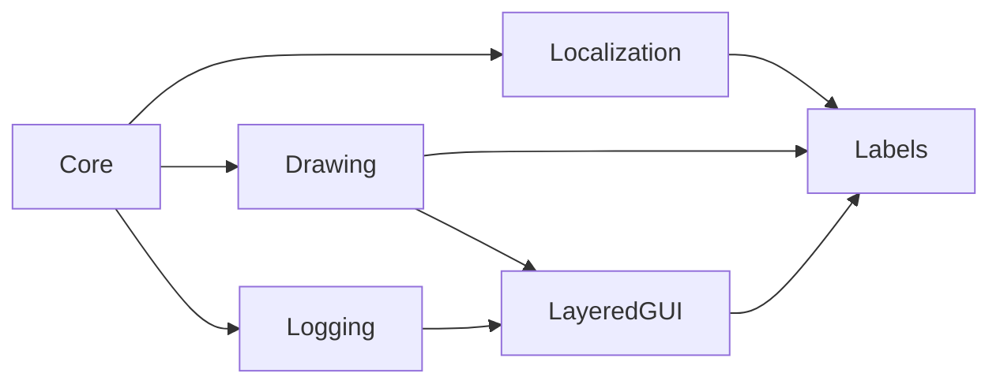

# Labels

`Labels` provides reusable game-space and GUI-space text objects with optional
localization, outlined text drawing, and attachable runtime text effects.

## Quickstart

Create a child of the game-space or GUI-space label, set `text`, and enable
`translate` when the value is a [`Localization`](localization.md) key.

```gml
// Child Create
event_inherited();

// Use a localization key instead of literal text.
text = "PLAY";
translate = true;
```

## Resources

- `scripts/gmcu_draw_text_outlined`
- `scripts/gmcu_label_effects`
- `objects/gmcu_o_base_label`
- `objects/gmcu_o_label_game`
- `objects/gmcu_o_label_gui`

## Dependencies

| Module | Responsibility |
| --- | --- |
| [`Localization`](localization.md) | Resolves translated label text. |
| [`LayeredGUI`](layered-gui.md) | Orders GUI-space label drawing. |
| [`Drawing`](drawing.md) | Protects draw state. |
| [`Core`](core.md) | Base dependency used by the shared resources above. |

## Dependency Diagram



## API

| Item | Kind | Description |
| --- | --- | --- |
| `gmcu_draw_text_outlined(_x, _y, _text, _outline_thickness = 0, _outline_color = c_white, _scale = 1)` | Function | Draws text with an optional outline. |
| `gmcu_label_add_effect(_label, _effect)` | Function | Attaches a reusable effect to a label instance. |
| `gmcu_label_start_effect(_effect)` | Function | Starts a previously attached label effect. |
| `gmcu_label_stop_effect(_effect)` | Function | Stops a running label effect without completing it. |
| `gmcu_LabelEffectFade(_duration_seconds, _from_alpha = 1, _to_alpha = 0)` | Struct constructor | Fades a label alpha over time. |
| `gmcu_LabelEffectTremble(_amplitude, _speed, _duration_seconds = undefined)` | Struct constructor | Applies a sinusoidal shake to a label. |
| `gmcu_o_base_label` | Object | Shared label behavior and drawing state. |
| `gmcu_o_label_game` | Object | Game-space label variant. |
| `gmcu_o_label_gui` | Object | GUI-space label variant. |

Set `translate` to use `gmcu_localization_t(text)`. The resolved string is
stored in `actual_text` and used for drawing. Labels also expose `text_scale`,
`text_valign`, `draw_alpha`, `draw_offset_x`, `draw_offset_y`,
`label_effects`, and `on_label_effect_finished(_effect)` for runtime
presentation work.

Fonts, colors, text keys, positions, and GUI priorities remain consumer-owned.
