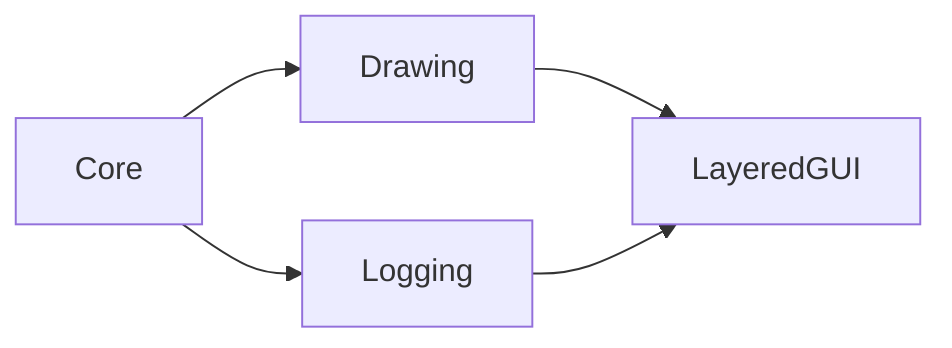

# LayeredGUI

`LayeredGUI` lets instances register an `on_draw_gui` callback with a priority
so GUI drawing can happen in a stable order from one Draw GUI manager. The
manager is created automatically on the first subscription.

## Quickstart

Subscribe in Create, define `on_draw_gui`, and unsubscribe in Clean Up:

```gml
// Create
// Register this instance in the shared Draw GUI stack.
gmcu_layered_gui_subscribe(GMCU_GUI_PRIORITY_DEFAULT, "play_button");

function on_draw_gui() {
	// Draw this instance in GUI space when the manager reaches its priority slot.
	draw_self();
}

// Clean Up
// Remove the instance before destruction so the manager keeps a valid list.
gmcu_layered_gui_unsubscribe();
```

Every subscriber must define `on_draw_gui` as a function on the instance.
Larger priority values draw earlier, so lower values appear later and can draw
over higher-priority subscribers. Subscribers with equal priorities keep their
subscription order.

Use the shared GUI priority constants from [`Core`](core.md) instead of raw
numbers when a known layer already exists:

- `GMCU_GUI_PRIORITY_DEFAULT`
- `GMCU_GUI_PRIORITY_LEADERBOARD_OVERLAY`
- `GMCU_GUI_PRIORITY_UNIVERSAL_CURSOR`
- `GMCU_GUI_PRIORITY_DEV_MENU`

The optional second argument is a human-readable diagnostic name. GameMaker
does not expose Room Editor instance names from a runtime instance id, so pass
an existing identifier such as a button id when several instances share the
same object. Omit it when the object name and runtime id are sufficient.

The manager skips a subscriber when the instance is hidden or its assigned
layer is hidden. After every callback it restores the captured draw state, so
changes to color, alpha, font, alignment, blend mode, and related drawing
parameters do not leak into the next subscriber.

Always unsubscribe in Clean Up. The manager reports and removes destroyed
instances, missing `on_draw_gui` callbacks, and callbacks that throw an
exception, but this recovery is diagnostic behavior rather than a replacement
for the normal lifecycle.

## Dev Menu Diagnostics

When both modules are imported, [`Dev Menu`](dev-menu.md) automatically adds a
`Layered GUI` page in rooms where the manager exists. The page lists subscribers
in their actual draw order as:

```text
priority | object name | diagnostic name | instance id
```

The list is captured from the live subscriber set each time the menu opens.
Invalid references are shown without interrupting the menu. Select a row and
press Enter, the gamepad confirmation button, or click it to copy the complete
row to the clipboard. No consumer configuration is required.

## Resources

- `objects/gmcu_o_layered_gui_manager`: Owns and draws the ordered subscriber
  list.
- `scripts/gmcu_layered_gui_subscribe`: Creates the manager when needed and
  registers the calling instance at a priority.
- `scripts/gmcu_layered_gui_unsubscribe`: Removes the calling instance from the
  manager.

## Dependencies

| Module | Responsibility |
| --- | --- |
| [`Drawing`](drawing.md) | Restores draw state after each subscriber. |
| [`Logging`](logging.md) | Reports invalid subscribers. |
| [`Core`](core.md) | Indirect dependency through Drawing and Logging. |

## Dependency Diagram



## API

| Item | Kind | Description |
| --- | --- | --- |
| `gmcu_o_layered_gui_manager` | Object | Automatically created Draw GUI manager. |
| `gmcu_layered_gui_subscribe(_priority, _diagnostic_name = undefined)` | Function | Registers `self`; larger priorities draw earlier. The optional name appears only in diagnostics. |
| `gmcu_layered_gui_unsubscribe()` | Function | Removes `self` when subscribed. |
| `on_draw_gui()` | Subscriber callback | Draws one subscriber entry when the manager reaches it. |

Subscribers define:

```gml
function on_draw_gui() {
}
```

`on_draw_gui` takes no parameters and returns no value.

Use shared GUI priority constants for known layers and preserve the descending
ordering contract when changing the manager. Add a new shared constant before
introducing another widely reused priority.
