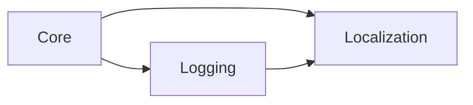

# Localization

`Localization` loads translations from a consumer-owned CSV included file and
returns localized text for the active language.

## Quickstart

Call `gmcu_localization_init()` during startup, or let
`gmcu_localization_t(_key)` lazily load the default `localization.csv`.

```gml
// Startup initialization with the default included CSV.
gmcu_localization_init();

// Later lookups use the active language.
play_label = gmcu_localization_t("PLAY");
```

## Resources

- `scripts/gmcu_localization_init`
- `scripts/gmcu_localization_macros`
- `scripts/gmcu_localization_t`

## Dependencies

| Module | Responsibility |
| --- | --- |
| [`Logging`](logging.md) | Reports CSV, language, and lookup diagnostics. |
| [`Core`](core.md) | Base dependency used directly and through Logging. |

## Dependency Diagram



## API

| Item | Kind | Description |
| --- | --- | --- |
| `GMCU_LOCALIZATION_IS_INITIALIZED` | Macro | Whether localization has already been initialized. |
| `gmcu_localization_init(_lang_code = undefined, _csv_file_name = "localization.csv")` | Function | Loads the CSV and selects the active language. |
| `gmcu_localization_t(_str)` | Function | Returns the localized string for a key, or the original key on fallback. |
| `global.gmcu_language` | Global | Active language code chosen by initialization. |
| `global.gmcu_loc_map` | Global | Loaded localization map. |

## CSV Format

The first row contains language codes. Column `0` contains translation keys,
and language columns start at column `1`.

Example:

```csv
key,en,es
PLAY,Play,Jugar
```

Call `gmcu_localization_init(undefined, "your-file.csv")` during project
startup when using a non-default file. If `_lang_code` is omitted, the module
uses `os_get_language()`. If lookup occurs before explicit initialization,
`gmcu_localization_t` lazily initializes with `localization.csv`. If the CSV
file, language column, or key is missing, lookups fall back to the original key
string.

## Contributing

Keep localization content in the consumer project, usually as an included file
such as `datafiles/localization.csv`. Do not move credentials, build output, or
project-specific translation content into Common Utils.

For editable submodule use, keep the consumer `.yyp` paths local:

- `scripts/gmcu_localization_init/gmcu_localization_init.yy`
- `scripts/gmcu_localization_macros/gmcu_localization_macros.yy`
- `scripts/gmcu_localization_t/gmcu_localization_t.yy`

Then symlink those local folders to the matching folders under
`vendor/gamemaker-common-utils`.
