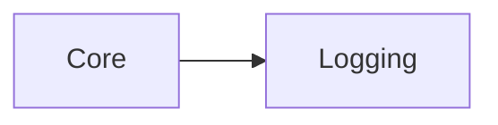

# Logging

`Logging` provides severity-aware output, a bounded development log buffer,
optional target output, and optional telemetry forwarding.

## Quickstart

Call `gmcu_log_debug`, `gmcu_log_info`, `gmcu_log_warn`, `gmcu_log_error`, or
`gmcu_log_exception`. Without adapters, messages use
`show_debug_message`.

```gml
// Basic severity-based logging.
gmcu_log_info("Game initialized");
gmcu_log_error("Save failed");
```

Register output or telemetry adapters only when the consumer needs them:

```gml
// Optional output adapter for another target or console.
gmcu_log_set_output_handler(function(_severity, _message) {
    target_console_write(_severity, _message);
});
```

## Resources

- `scripts/gmcu_log_config`: Severity macros, adapters, recursion protection,
  and development buffer.
- `scripts/gmcu_log_get_tags`: Builds room/object context tags.
- `scripts/gmcu_log_debug`, `gmcu_log_info`, `gmcu_log_warn`,
  `gmcu_log_error`, and `gmcu_log_exception`: Public severity functions.

## Dependencies

| Module | Responsibility |
| --- | --- |
| [`Core`](core.md) | Supplies build configuration, context names, and the optional notification-handler registry. |

## Dependency Diagram



## API

| Item | Kind | Description |
| --- | --- | --- |
| `gmcu_log_debug(_message, _local_only = false)` | Function | Writes debug output when `GMCU_ENABLE_DEBUG_LOG` is enabled. |
| `gmcu_log_info(_message)` | Function | Writes informational output. |
| `gmcu_log_warn(_message)` | Function | Writes warning output. |
| `gmcu_log_error(_message, _show_notification = true)` | Function | Writes an error and optionally requests a visual notification. |
| `gmcu_log_exception(_exception, _tag = "", _show_notification = true)` | Function | Formats and reports an exception. |
| `gmcu_log_set_output_handler(_handler)` | Function | Replaces target output. |
| `gmcu_log_set_telemetry_handler(_handler)` | Function | Sets optional telemetry forwarding. |
| `gmcu_log_buffer_get()` | Function | Returns the bounded Dev Menu log buffer. |
| `gmcu_log_buffer_clear()` | Function | Clears the bounded Dev Menu log buffer. |
| `gmcu_log_buffer_set_capacity(_capacity)` | Function | Changes the bounded Dev Menu log buffer capacity. |
| `gmcu_log_viewer_filters_get()` | Function | Returns the built-in Dev Menu log severity filter state. |
| `gmcu_log_viewer_filters_is_level_visible(_level)` | Function | Returns whether the built-in Dev Menu viewer should show a severity. |
| `gmcu_log_viewer_filters_toggle_level(_level)` | Function | Toggles one built-in Dev Menu viewer severity. |
| `gmcu_log_viewer_filters_reset()` | Function | Restores the built-in Dev Menu viewer to show all severities. |
| `GMCU_LOG_LEVEL_*` | Macros | Severity constants stored in the log buffer. |
| `GMCU_ENABLE_*_LOG` | Macros | Build-policy macros that control which severities are emitted. |

[`InGameNotifications`](in-game-notifications.md) can register the optional
visual handler. Logging does not depend directly on analytics SDKs or HTML5.
The built-in Dev Menu log viewer can filter buffered entries by severity
without changing what gets written to the buffer.
