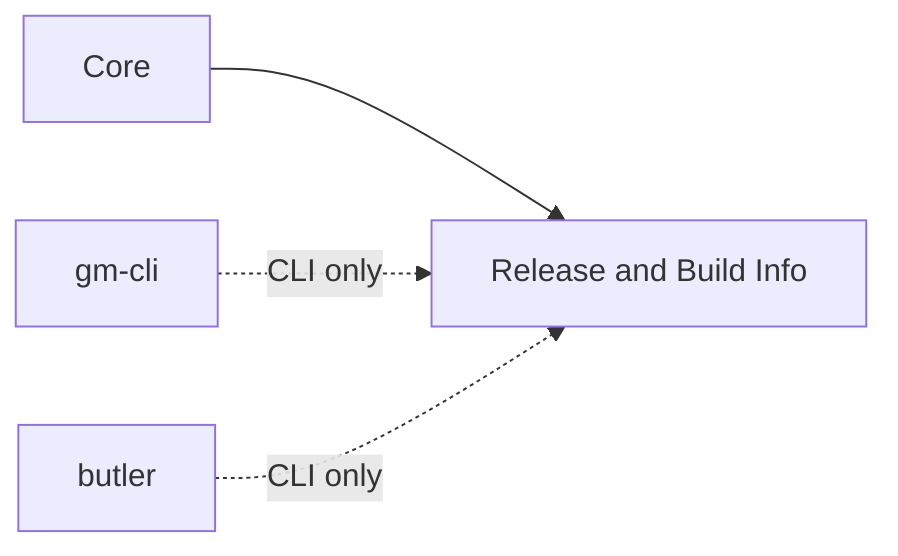

# Release and Build Info

This module separates export, testing, versioning, and publication by design.
An export is never published automatically: test the exact artifact first,
then invoke `deploy` explicitly.

## Quickstart

Copy `tools/release/Release.command` into the consumer repository root, make it
executable, and provide root `itch-config.json`. Double-click the launcher for
`Serve HTML build`, `Stop HTML server`, and `Publish to itch.io`.

Run the shared tool from the consumer repository:

```sh
# Open the same interactive menu as the launcher.
python3 vendor/gamemaker-common-utils/tools/release/gmcu_release.py menu

# Export and immediately serve the configured HTML platform.
python3 vendor/gamemaker-common-utils/tools/release/gmcu_release.py \
  export --platform html --serve

# Serve an existing HTML export without rebuilding it.
python3 vendor/gamemaker-common-utils/tools/release/gmcu_release.py \
  serve-html --open

# Stop the background HTML server.
python3 vendor/gamemaker-common-utils/tools/release/gmcu_release.py \
  stop-html

# Inspect resolved paths, versions, and server status.
python3 vendor/gamemaker-common-utils/tools/release/gmcu_release.py \
  status

# Bump the tracked platform version without deploying.
python3 vendor/gamemaker-common-utils/tools/release/gmcu_release.py \
  version --platform html

# Deploy an already tested export.
python3 vendor/gamemaker-common-utils/tools/release/gmcu_release.py \
  deploy --platform html
```

Commands default to root `itch-config.json`; `--config` supports explicit paths.

`export` uses `gm-cli package` by default. As of gm-cli 2.1.0, the official CLI
reports that HTML5 target support is still coming soon. Consumers may provide a
platform-specific `export_command` array using `{project}`, `{output}`,
`{platform}`, `{target}`, `{runtime}`, `{config}`, and `{toolchain}`
placeholders. Otherwise, export HTML from GameMaker and use `serve-html`.

`--serve` is valid only for the configured HTML platform and starts the same
background server as `serve-html`. The server listens on all interfaces and
prints localhost and LAN URLs. If the preferred port is occupied, it selects
the next available port automatically and verifies that `index.html` responds
before registering the server. An explicit `--port` remains strict and fails
when occupied. State and logs go under the consumer-defined `server_state`
path; commit neither file.

`deploy` requires a clean `main` and confirmation that the exact export was tested.
Automation passes `--yes-tested`. It reads the latest channel version from Butler,
falls back to the versioned counter, and updates generated version files plus the
selected GameMaker target's source version. A successful upload is followed by a
commit of only the counter and selected target options, a `releases/v<version>`
tag, and a separate prompt to push the commit/tag.

A failed upload restores the version files. If Git bookkeeping fails after upload,
the tool prints recovery commands; it does not undo the itch.io release.

Install and authenticate Butler before using `status` or `deploy`:

```sh
butler login
butler status username/project
```

The CLI searches `PATH`, `~/bin/butler`, and the macOS itch app's managed
Butler installation. A consumer may override this with `tools.butler`.

## Resources

- `tools/release/gmcu_release.py`: Export, serve, version, status, and deploy
  CLI.
- `scripts/gmcu_build_info`: Runtime build metadata API.
- `objects/gmcu_o_build_info_label`: Optional bottom-right build label.

## Dependencies

| Dependency | Responsibility |
| --- | --- |
| [`Core`](core.md) | Supplies build configuration policy to runtime resources. |
| `gm-cli` | Used by the export workflow when the chosen platform supports it. |
| `butler` | Used by `status` and `deploy`. |

## Dependency Diagram



## Consumer Configuration

The normal consumer file is intentionally small:

```json
{
  "username": "studio",
  "project_name": "game",
  "platforms": ["html", "windows"]
}
```

Platform order supplies stable IDs starting at `1`. Common Utils infers the
consumer `.yyp`, `Builds/<platform>`, matching itch channel names,
`options.ini`, `buildnumber.txt`, `itch-deploy/config.jsonc`, and the HTML server defaults.
Advanced projects may override those fields, but ordinary consumers should not
repeat conventions.

## API

Import or symlink:

- `scripts/gmcu_build_info`
- `objects/gmcu_o_build_info_label`

Initialize before analytics or UI creation:

```gml
gmcu_build_info_init({
    author: "Studio Name",
    copyright_start_year: 2024
});
global.build_number = gmcu_build_info_get_version();
```

Optional fields are `version_prefix`, `separator`, and `build_file`. Missing
`buildnumber.txt` falls back to `GM_version + "-dev"`.

The shared label preserves Fantasma's bottom-right black background and white
text. Consumer-specific author and date values are supplied at initialization.

| Item | Kind | Description |
| --- | --- | --- |
| `tools/release/gmcu_release.py` | CLI | Export, serve, inspect, version, and deploy builds. |
| `gmcu_build_info_init(_options)` | Function | Initializes runtime build metadata. |
| `gmcu_build_info_get_version()` | Function | Returns the current build version string. |
| `gmcu_o_build_info_label` | Object | Optional bottom-right build label. |

Consumer repositories retain build paths, export artifacts, itch.io
destinations, version state, credentials, and presentation values.
