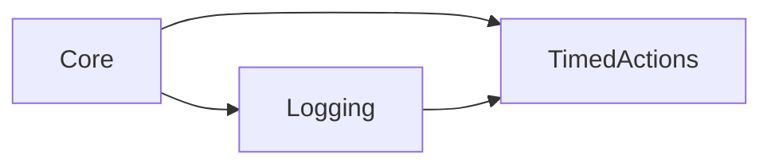

# Timed Actions

`TimedActions` schedules callbacks after a number of Step events or elapsed
seconds.

## Quickstart

Call `gmcu_wait_for_seconds` or `gmcu_wait_for_steps`; the manager is created
automatically on the first scheduled action.

```gml
// Run a callback after one second of elapsed time.
gmcu_wait_for_seconds(1, function() {
	show_debug_message("One second later");
});

// Run a callback after 30 Step events.
gmcu_wait_for_steps(30, function() {
	show_debug_message("Thirty steps later");
});
```

## Resources

- `objects/gmcu_o_timed_actions_manager`
- `scripts/gmcu_wait_for_seconds`
- `scripts/gmcu_wait_for_steps`

## Dependencies

| Module | Responsibility |
| --- | --- |
| [`Core`](core.md) | Supplies delta-time and singleton support. |
| [`Logging`](logging.md) | Reports execution and callback failures. |

## Dependency Diagram



## API

| Item | Kind | Description |
| --- | --- | --- |
| `gmcu_wait_for_seconds(_seconds, _action)` | Function | Schedules a callback after elapsed seconds. |
| `gmcu_wait_for_steps(_steps, _action)` | Function | Schedules a callback after a number of Step events. |

The first scheduled action creates `gmcu_o_timed_actions_manager`. The manager
is persistent, rejects duplicate instances, catches callback exceptions, and
removes completed actions. Step-scheduled callbacks emit
`Executing scheduled action` through Logging immediately before execution.

## Contributing

Callbacks run from the manager's Step event. A callback scheduled for zero or a
negative delay runs on the next manager Step.

Keep the listed resource paths local and symlink their folders to Common Utils.
